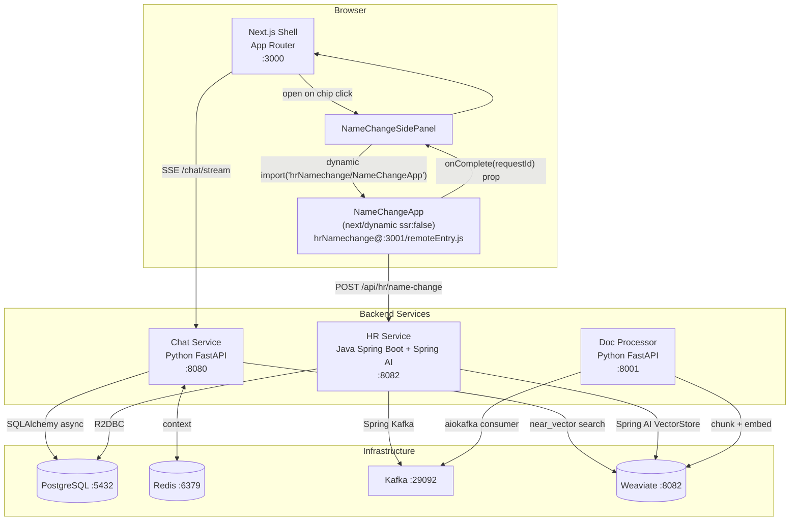
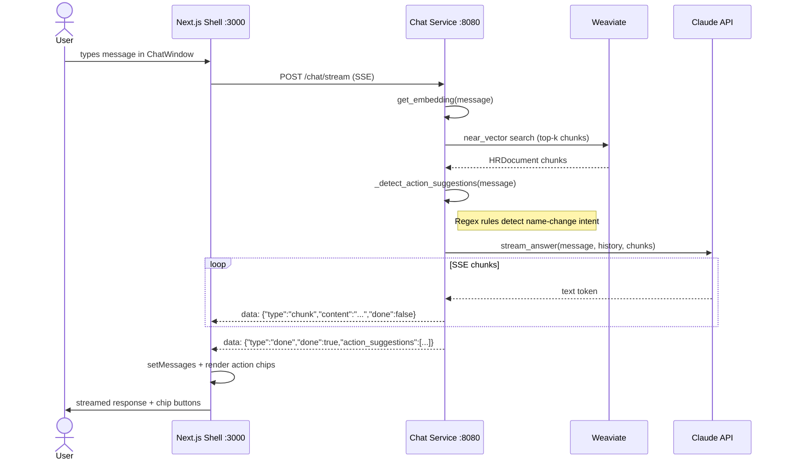
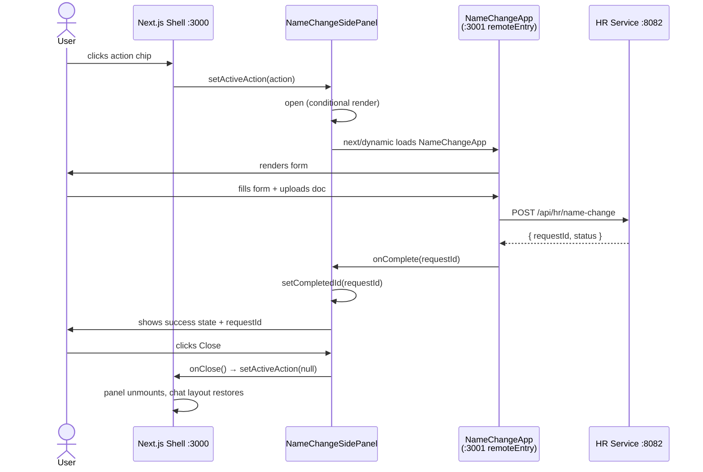
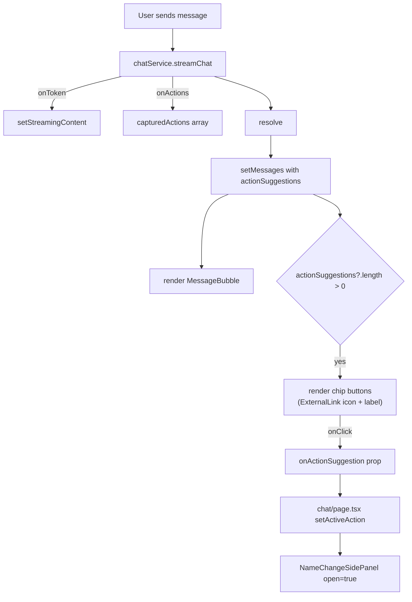

# Architecture — EKAP Next.js MFE

## Integration Pattern: Next.js App Router shell + Webpack 5 MFE remote

The shell is a **Next.js 14 App Router** application that consumes a plain **Webpack 5 Module Federation** remote using the `@module-federation/nextjs-mf` bridge. The HR name-change mini-app is loaded with `next/dynamic({ ssr: false })` and receives a typed React `onComplete` callback prop — no iframes, no `postMessage`. The HR service uses **Spring AI 1.0** for RAG instead of a direct Anthropic SDK call.

---

## System Overview



---

## Service Catalogue

| Service | Image / Build | Port | Language | Responsibility |
|---|---|---|---|---|
| shell | `./frontend/shell` | 3000 | Next.js 14, React 18, Tailwind | App Router shell: chat UI, file-system routing, MFE consumer |
| hr-namechange (remote) | `./frontend/remotes/hr-namechange` | 3001 | React 18, Webpack 5 | MFE remote: exposes `NameChangeApp` via `remoteEntry.js` |
| chat-service | `./backend/chat-service` | 8080 | Python FastAPI | RAG chat: embedding, Weaviate retrieval, Claude streaming, intent → action_suggestions |
| hr-service | `./backend/hr-service` | 8082 | Java Spring Boot + Spring AI 1.0 | HR domain: name-change workflow, Spring AI RAG, Kafka producer |
| doc-processor | `./backend/doc-processor` | 8001 | Python FastAPI | Document chunking, fastembed embeddings, Weaviate indexing |
| postgres | postgres:16 | 5432 | — | Chat sessions/messages, name-change request state |
| redis | redis:7 | 6379 | — | Conversation context cache |
| kafka | confluentinc/cp-kafka:7.6.0 | 29092 | — | `hr.events`, `hr.namechange`, `document.*` topics |
| zookeeper | confluentinc/cp-zookeeper:7.6.0 | 2181 | — | Kafka cluster coordination |
| weaviate | semitechnologies/weaviate:1.27.0 | 8082(H)/50051(gRPC) | — | Vector store; near_vector + BM25 search |

---

## Module Federation Wiring

```mermaid
graph LR
    subgraph Shell — Next.js :3000
        A["next.config.js<br/>NextFederationPlugin"]
        B["NameChangeSidePanel.tsx<br/>next/dynamic({ ssr: false })"]
        C["app/hr/name-change/page.tsx<br/>next/dynamic({ ssr: false })"]
    end

    subgraph Remote — Webpack :3001
        D[webpack.config.js<br/>ModuleFederationPlugin]
        E[remoteEntry.js]
        F["NameChangeApp.tsx<br/>Props: { onComplete }"]
    end

    A -->|declares remote| E
    B -->|"import('hrNamechange/NameChangeApp')"| F
    C -->|"import('hrNamechange/NameChangeApp')"| F
    F -->|"onComplete(requestId)"| B
```

**`next.config.js`:**
```js
new NextFederationPlugin({
  name: 'shell',
  filename: 'static/chunks/remoteEntry.js',
  remotes: {
    hrNamechange: `hrNamechange@${process.env.NEXT_PUBLIC_REMOTE_HR_NAMECHANGE_URL || 'http://localhost:3001'}/remoteEntry.js`,
  },
  shared: {
    react:     { singleton: true, eager: true, requiredVersion: false },
    'react-dom': { singleton: true, eager: true, requiredVersion: false },
  },
})
```

> **Important:** The remote URL must point to the **plain Webpack** `remoteEntry.js` at the root (`/remoteEntry.js`), not the Next.js chunk path (`/_next/static/chunks/remoteEntry.js`).

**`next/dynamic` consumption:**
```tsx
const NameChangeApp = dynamic(
  () => import('hrNamechange/NameChangeApp'),
  { ssr: false }    // required — remote is a browser-only Webpack bundle
);

<NameChangeApp onComplete={(requestId) => handleComplete(requestId)} />
```

---

## Chat Data Flow



---

## Name Change Flow (Next.js + MFE Props Pattern)



---

## Shell App Router Layout

```
app/
├── layout.tsx              ← Root layout: SideNav + TopBar wrapper
├── page.tsx                ← Home → redirects to /chat
├── chat/
│   └── page.tsx            ← "use client" — ChatWindow + NameChangeSidePanel split layout
├── hr/
│   └── name-change/
│       └── page.tsx        ← Standalone name change page (also loads MFE)
└── documents/
    └── page.tsx            ← Document upload / list page
```

**Chat page split-panel layout:**
```
┌─────────────────────────────────────────────┐
│ SideNav │  ChatWindow (flex-1)  │ Panel (w-96) │
│         │  [messages]           │ [NameChangeApp] │
│         │  [input bar]          │ (when open)  │
└─────────────────────────────────────────────┘
```

When an action chip is clicked, `activeAction` state opens the side panel. The `ChatWindow` remains interactive alongside it.

---

## ChatWindow → Action Chips Flow



---

## Intent Detection (Chat Service)

The Python chat service uses regex rules to detect action-triggering intents **before** streaming begins:

```python
_ACTION_RULES = [
    (
        re.compile(
            r"\b(change|update|correct|amend|modify|request)\b.{0,40}"
            r"\b(name|last\s*name|surname|family\s*name|legal\s*name)\b"
            r"|\b(name\s*change|surname\s*change)\b",
            re.IGNORECASE,
        ),
        {"mini_app_id": "hr-name-change", "label": "Start Name Change Request"},
    ),
]
```

Action suggestions are returned in the SSE `done` event:
```json
{"type": "done", "done": true, "action_suggestions": [{"mini_app_id": "hr-name-change", "label": "Start Name Change Request"}]}
```

---

## Spring AI vs. Direct Anthropic SDK

This version's HR service uses **Spring AI 1.0** instead of calling the Anthropic API directly:

| Concern | Direct SDK (ekap-iframe / ekap-react-mfe) | Spring AI (ekap-nextjs-mfe) |
|---|---|---|
| RAG retrieval | Custom Weaviate GQL via raw client | `VectorStore` abstraction (Spring AI) |
| LLM call | `anthropic.messages.create()` | `ChatClient.prompt().call()` |
| Prompt templating | Manual string concat | `PromptTemplate` / `@SystemPrompt` |
| Model switching | Config string | Spring Boot auto-configuration |
| Streaming | Manual SSE chunks | `Flux<String>` → SSE |

---

## Weaviate / RAG Setup

| Detail | Value |
|---|---|
| Collection | `HRDocument` |
| Vectorizer module | `none` |
| Embedding model | `BAAI/bge-small-en-v1.5` (fastembed ONNX) |
| Search method | `near_vector` (chat-service), BM25 (hr-service fallback) |
| gRPC port | 50051 (required by weaviate-client v4) |
| Min Weaviate version | 1.27.0 (Python client v4 requirement) |

---

## Key Design Decisions

| Decision | Rationale |
|---|---|
| `next/dynamic({ ssr: false })` | Remote is a browser-only Webpack bundle; SSR would attempt to import it on the Node.js server where the remote URL is unreachable |
| `NEXT_PUBLIC_*` = localhost URLs | Next.js bakes `NEXT_PUBLIC_` vars into the browser bundle at build time. Docker-internal hostnames (e.g. `chat-service:8000`) are not reachable by the browser |
| Plain Webpack remote, not Next.js remote | `@module-federation/nextjs-mf` can consume plain Webpack 5 remotes. The remote's `remoteEntry.js` lives at the root path, not under `/_next/` |
| Weaviate 1.27.0+ | Python weaviate-client v4 requires at minimum 1.27.0 for gRPC support |
| Spring AI for HR service | Demonstrates how the same architecture applies with the Spring ecosystem's AI abstraction layer |
| Redis for context | Fast, TTL-able storage for per-session conversation history, keeping chat-service horizontally scalable |
