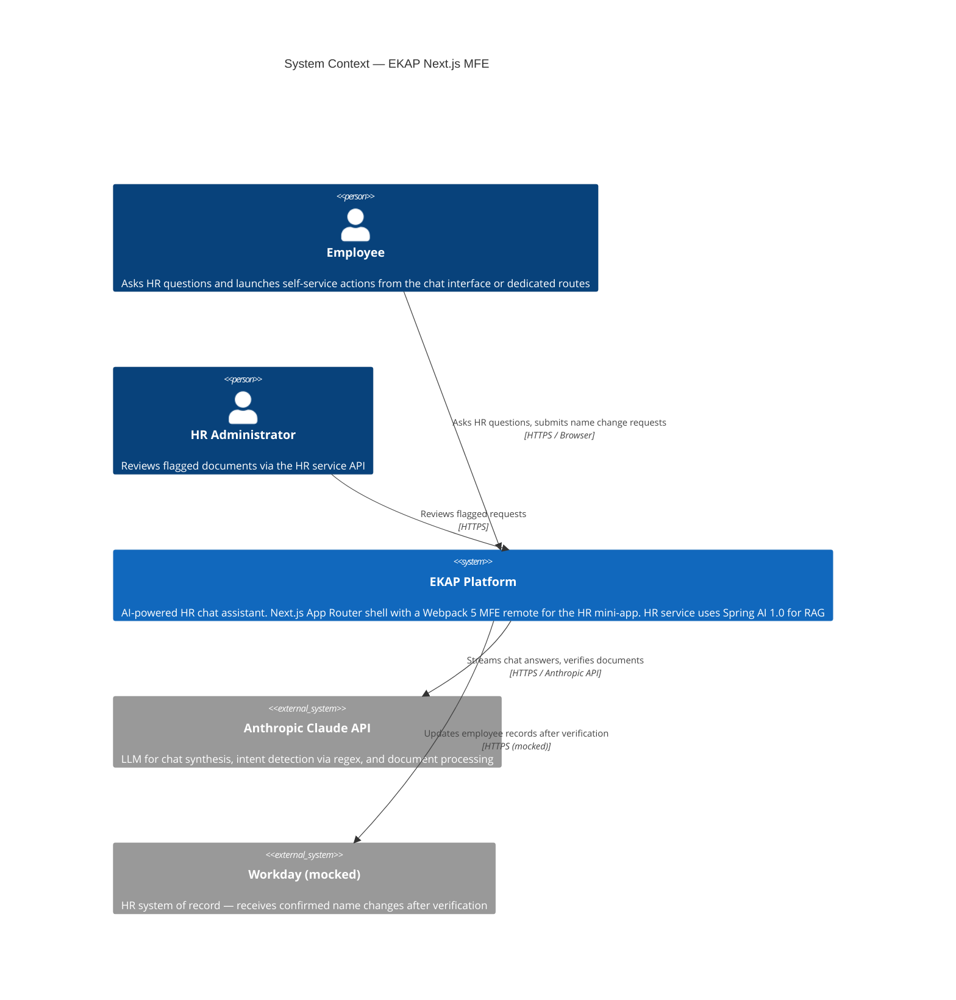
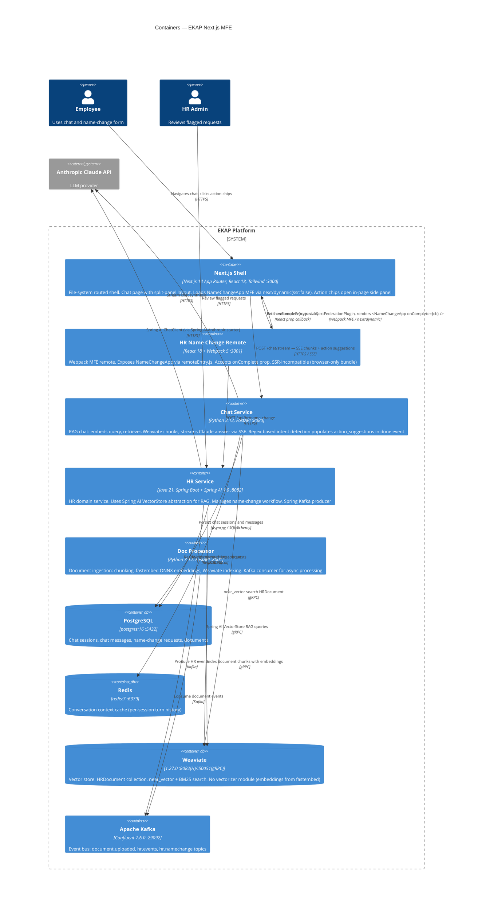
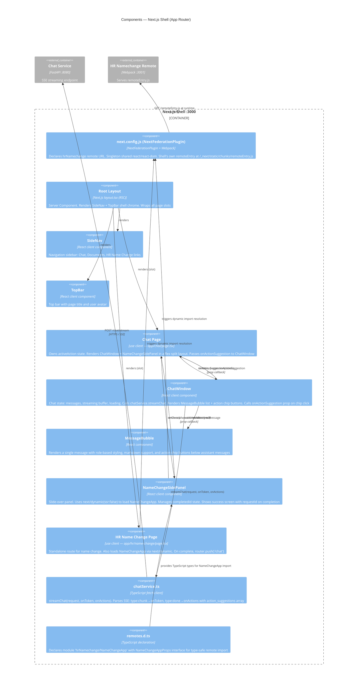
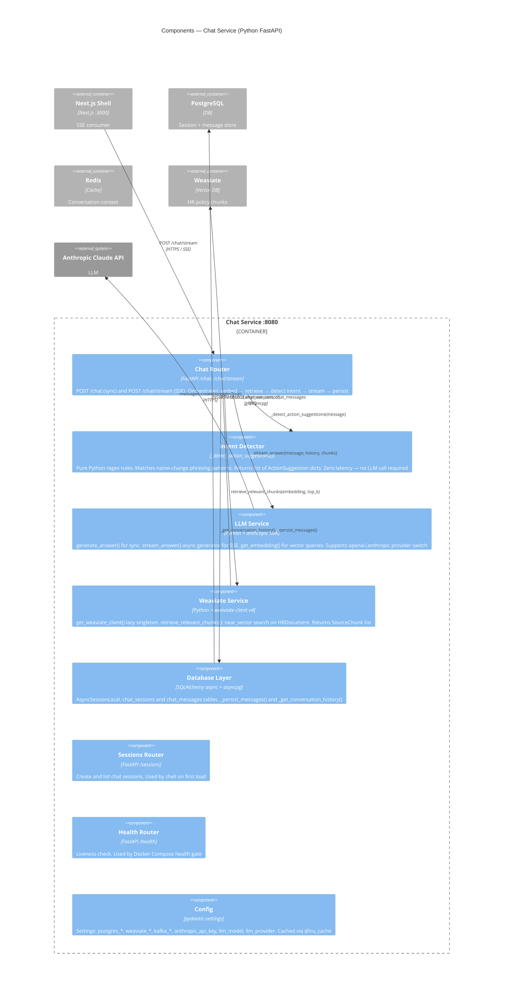
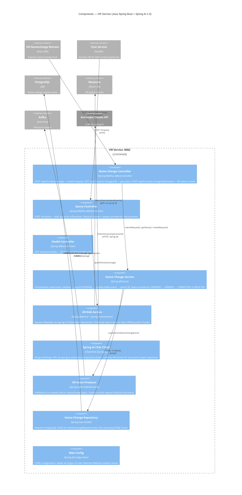
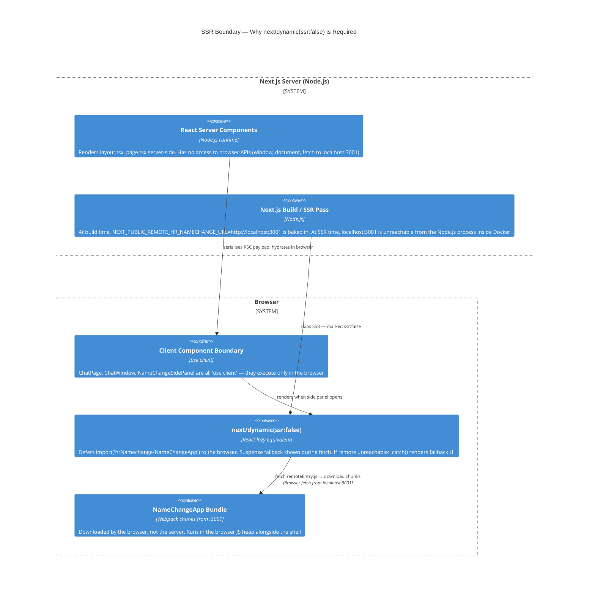
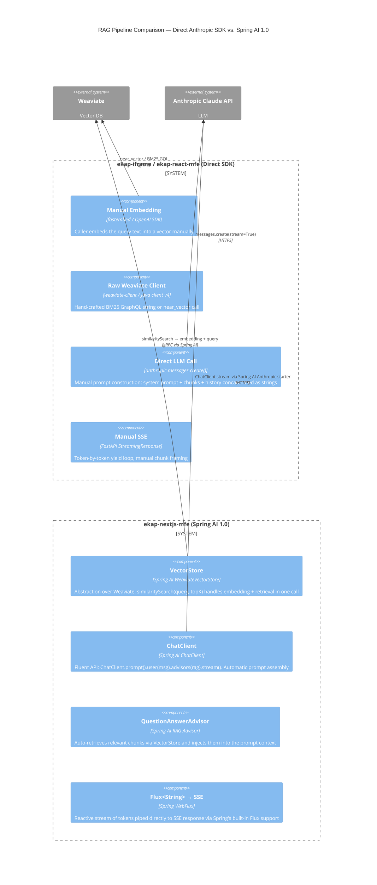

# C4 Architecture — EKAP Next.js MFE

> C4 model levels: **Context → Containers → Components**
> Diagrams use [Mermaid C4](https://mermaid.js.org/syntax/c4.html) and render natively on GitHub.

---

## Level 1 — System Context

Who uses the system and what external systems does it depend on?

---

## Level 2 — Containers

What are the independently deployable / runnable units and how do they communicate?

---

## Level 3 — Components: Next.js Shell

What are the major internal components of the Next.js shell and how does it integrate the MFE?

---

## Level 3 — Components: Chat Service

---

## Level 3 — Components: HR Service (Spring AI)

---

## Key Architectural Differentiator: next/dynamic + SSR Boundary

This diagram explains why `ssr: false` is mandatory for the MFE remote in a Next.js App Router context:

---

## Spring AI vs. Direct SDK (C4 Component Comparison)

